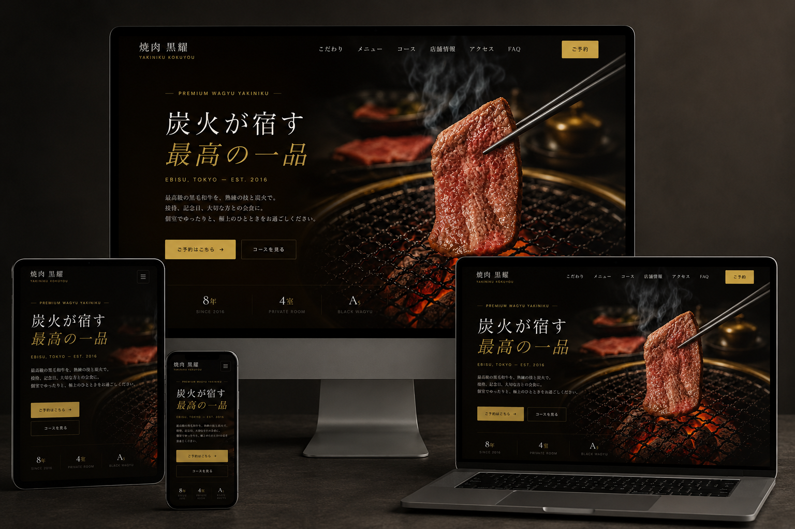

[README.md](https://github.com/user-attachments/files/28080486/README.md)
# 焼肉 黒耀 ｜ Brand Experience Site

> 恵比寿の高級焼肉店「焼肉 黒耀」のブランドサイト。
> 企画設計から実装まで一気通貫で担当した、実店舗を想定したブランディング制作物です。

---

## 🔗 Live Demo

| 種別 | URL |
|---|---|
| **公式サイト（本リポジトリ）** | https://hirotonozaki.github.io/yakiniku-kokuyou/ |
| 企画提案書 | https://hirotonozaki.github.io/yakiniku-kokuyou-proposal/ |

> 設計意図・ターゲット定義・KPI・競合分析・情報設計の各プロセスは、企画提案書（全30ページ）にまとめています。

---

## Preview



---

## QR Code

スマートフォン実機での表示確認用。


---

## 制作意図

「実店舗の格を、画面の中でも保つ」ことを設計の唯一の指針として組み立てました。

恵比寿の高級焼肉店は **接待・記念日・デート** 利用が中心で、ユーザーは常に「失敗できない夜」という文脈で店を選びます。料金や雰囲気が言葉で伝わるだけでは足りず、画面そのものが店の照明設計と同じ温度を持つ必要がある — これが本サイトの出発点です。

漆黒（#0A0805）と古金色（#C9A84C）のミニマルな配色、Cormorant Garamond × 游明朝の和洋ペアリング、写真を主役にした広い余白で、ブランド体験としての品格を担保しています。

---

## UI/UXで工夫した点

| # | 工夫 | 意図 |
|---|---|---|
| 1 | **2階層CTA設計**（ご予約 / コースを見る） | 検討段階の異なるユーザーを取りこぼさない |
| 2 | **空席カレンダー予約UI** | 一般的なフォームではなく「席選びの体験」として再設計 |
| 3 | **営業時間ステータス自動表示** | 現在時刻から「営業中／準備中」を動的判定 |
| 4 | **タブ式メニュー切替** | 桐・竹・松の3コースをスクロールせず比較可能 |
| 5 | **FAQアコーディオン** | 同時に1件のみ展開、ファーストビュー時は1件目を開いて認知性UP |
| 6 | **スクロール連動アニメ** | IntersectionObserverで軽量に。`prefers-reduced-motion` 対応 |
| 7 | **モバイル/デスクトップで導線最適化** | アクセス情報の表示優先度を切り替え |

---

## 使用技術

### Frontend
- **HTML5** — セマンティック構造、`aria-*` によるアクセシビリティ配慮
- **CSS3** — CSS変数によるデザイントークン一元管理、Flexbox / Grid、`prefers-reduced-motion` 対応
- **Vanilla JavaScript** — ES6+、フレームワーク非依存、IIFE構成

### Typography
- **Cormorant Garamond / DM Sans**（Google Fonts、`preconnect` で初期描画最適化）
- **游明朝**（システム搭載フォントスタック、ネットワーク不要で和文を高品質表示）

### Hosting
- **GitHub Pages** — SSL自動、CDN配信、ビルド不要

---

## 制作期間

企画設計からデザイン、実装、改善まで含め約3週間。

---

## ディレクトリ構成

```
.
├── index.html              トップページ（コンセプト〜FAQまで1ページ完結）
├── reserve.html            予約ページ（空席カレンダー・人数選択・ステップフォームUI）
├── css/
│   ├── style.css           共通スタイル（変数 → ベース → コンポーネント）
│   └── reserve.css         予約ページ専用スタイル
├── js/
│   ├── main.js             全UIロジック
│   └── reserve.js          予約フロー専用ロジック
└── assets/
    └── images/             ブランド写真・OGP・モックアップ画像
```

---

## ローカル表示

```bash
git clone https://github.com/hirotonozaki/yakiniku-kokuyou.git
cd yakiniku-kokuyou
```

ビルド不要のバニラ構成のため、ブラウザで `index.html` を開くことで閲覧できます。

---

## 今後の拡張計画（実運用フェーズ）

実案件として継続運用する場合、以下の段階的な拡張を想定しています。

- [ ] **予約フローのバックエンド連携** — フォーム送信先のAPI実装、空席情報の動的取得、予約管理画面の構築
- [ ] **CMS化** — お知らせ・メニュー・コース内容を店舗側で更新可能な構成へ移行（microCMS等のHeadless CMSを想定）
- [ ] **Lighthouseスコア最適化** — 画像のWebP / AVIF化、Critical CSS抽出、フォントのサブセット化
- [ ] **構造化データ対応** — `Restaurant` スキーマのJSON-LD埋め込みによる検索結果の最適化
- [ ] **多言語対応** — 英語・繁体字・簡体字の3言語展開、インバウンド需要への対応
- [ ] **A/Bテスト基盤の導入** — 予約導線・コース表現のCVR改善を定量的に検証

---

## ライセンス

本リポジトリは制作実績として公開しています。
コードの引用・参考は自由ですが、原稿コピーおよび写真素材の再配布はご遠慮ください。

---

<sub>Designed & Developed by [@hirotonozaki](https://github.com/hirotonozaki)</sub>
